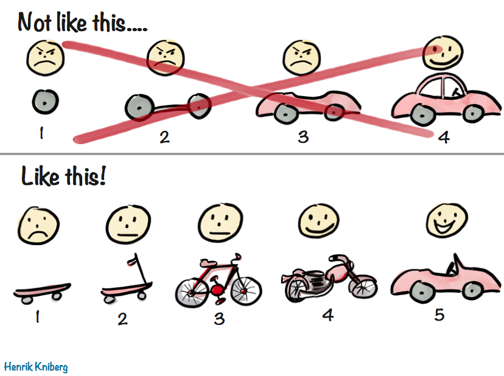

```{r setup, include=FALSE}
options(htmltools.dir.version = FALSE)
```

```{r xaringan-themer, include=FALSE}
# sds::duo_smith()
sds::mono_light_smith()
```

# What is Data Science?

.pull-left[

* Interdisciplinary field combining computer science, mathematics/statistics, and domain expertise to extract meaningful information from unstructured data points.
   
]
      
.pull-right[
      


]
---

# Case Study 1: ACLU Fights Discriminatory Housing 

.pull-left[

* American Civil Liberties Union employs [data scientists](https://medium.com/aclu-tech-analytics/meet-the-aclu-analytics-team-4644d4f20dae) to produce insights regarding discriminatory laws and practices.
* Findings are presented in courts, legislatures, and public reports.
* In [this study](https://www.aclu.org/blog/racial-justice/race-and-economic-justice/lawsuit-challenges-discriminatory-housing-policy), they use public data to show that excluding people with criminal records from housing can be viewed as a violation of the US Fair Housing Act. 

]
      
.pull-right[


]
---

# Case Study 2: EPA Tracks Environmental Injustice

.pull-left[

* Environmental Protection Agency hires [data scientists](https://www.epa.gov/careers/science-careers-epa) to produce insights regarding environmental health risks.
* Findings implicate environmental policies, funding allocations, and legal actions against states and industries.
* [This tool](https://www.epa.gov/ejscreen), visualizes environmental and demographic indicators to highlight communities experiencing environmental injustices.  

]

.pull-right[


]
---

# We have had data for a long time. It is not new. However, those studies were not possible 30 years ago. Why is data science so popular today?

---
      
# Big Data
      
* "Between the dawn of civilization and 2003, we only created five exabytes of information; now we're creating that amount every two days." 
Eric Schmidt, Goolge (and others)
      

      
---
      

      
---


      
---
      

      
---
      

      
---

# Development of Tools

.pull-left[

* 1940s: [Monroe LN-160X](http://www.vintagecalculators.com/html/monroe_ln-160x.html)
* 1947: [Victor is the world's largest exclusive manufacturer of adding machines](https://en.wikipedia.org/wiki/Victor_Technology)

]

.pull-right[


]
---

.pull-left[

* 1973: [TI SR-10](https://en.wikipedia.org/wiki/Calculator#History) pocket calculator
* 1977: [Apple II](https://en.wikipedia.org/wiki/Apple_II) 
* 1981: [MS-DOS](https://en.wikipedia.org/wiki/MS-DOS) first released
* 1986: [SQL](https://en.wikipedia.org/wiki/SQL) becomes a standard of the American National Standards Institute (ANSI)

]

.pull-right[


]
---

.pull-left[

* 1990: [Windows 3.0](https://en.wikipedia.org/wiki/Windows_3.0)
* 1995: [Excel 7.0](https://en.wikipedia.org/wiki/Microsoft_Excel#Number_of_rows_and_columns) can handle at most 16k rows
* 1998: [iMac G3](https://en.wikipedia.org/wiki/IMac_G3)

]

.pull-right[


]
---

.pull-left[

* 2003: [Excel 11.0](https://en.wikipedia.org/wiki/Microsoft_Excel#Number_of_rows_and_columns) can handle at most 64k rows
* 2005: [MySQL](https://en.wikipedia.org/wiki/MySQL) powers Google      
* 2007: [Excel 12.0](https://en.wikipedia.org/wiki/Microsoft_Excel#Number_of_rows_and_columns) can handle at most 1M rows

]

.pull-right[

 
By Vectorised from <a rel="nofollow" class="external free" href="https://labs.mysql.com/common/logos/mysql-logo.svg">https://labs.mysql.com/common/logos/mysql-logo.svg</a>, <a href="//en.wikipedia.org/wiki/File:MySQL_logo.svg" title="Fair use of copyrighted material in the context of MySQL">Fair use</a>, <a href="https://en.wikipedia.org/w/index.php?curid=67634535">Link</a>

]
---

# Science Paradigms

* Thousand years ago: Science was ***empirical*** describing natural phenomena.
* Last few hundred years: ***Theoretical*** branch using models and generalizations.
* Last few decades: ***Computational*** branch simulating complex phenomena.
* Today: ***Data exploration*** (eScience) using experiment and simulation.
      * Data captured by instruments or generated by simulator
      * Processed by software
      * Information/Knowledge stored in computer
      * Scientist analyzes databases/files using data management and statistics
      
---


      
---
      

      
---
      


      
---

* "The ability to take ***data*** -- to be able to ***understand*** it, to ***process*** it, to ***extract value*** from it, to ***visualize*** it, to ***communicate*** it is going to be a hugely important skill in the next decades, not only at the professional level but even at the educational level for elementary school kids, for high school kids, for college kids. Because now we really do have essentially free and ***ubiquitous data***." Hal Varian, Prof. Emeritus at UC Berkeley, Chief Economist at Google

---

# Data Science for Good Opportunities
      
* [Human Rights Data Analysis Group](https://hrdag.org/)
* [Data Science for Social Good](https://www.dssgfellowship.org/)      
* [Stanford Computational Policy Lab](https://policylab.stanford.edu/) 
* [AI for Good](https://ai4good.org/) 
* [Data Kind](https://www.datakind.org/) 
      
---
  
# About Me

---
      
# About You

* What is your name? By what name would you like to be addressed?
* What are your pronouns if you are comfortable sharing?
* What is your major and year?
* Where are you from?
* What do you hope to get out of this course?
* What is an ungoogleable fun fact about you?
      
---
      
# How to Become a Data Scientist?

.pull-left[

* Programming with data
      * R or Python and SQL
      * See CSC 111 for Python
* Statistical modeling
      * SDS 220 + SDS 291 + SDS 293
* Communication
      * SDS 109, 235, or 236
* Domain knowledge
      
]
      
.pull-right[

 

]
---
      
# Topics Covered in This Course

.pull-left[

* Data visualization
* Data wrangling
* Mapping
* Database querying (SQL)
* Data science ethics
      
]
---

# Executive Summary of Syllabus
      
---
      
# Coding Can Be Intimidating!

.pull-left[
      
* Coding is like learning a new language. When you are first learning it, it all feels completely unfamiliar. I will work to support you in building the vocabulary and syntax to code in R.
* Coding can be frustrating. I regularly lose hours of my day in trying to find bugs in my code. I will work to give you resources and skills to navigate coding frustrations. 
* Coding social environments have historically been exclusionary. I will work to reduce barriers to coding in whatever ways I can. 

]
      
.pull-right[

 

]
