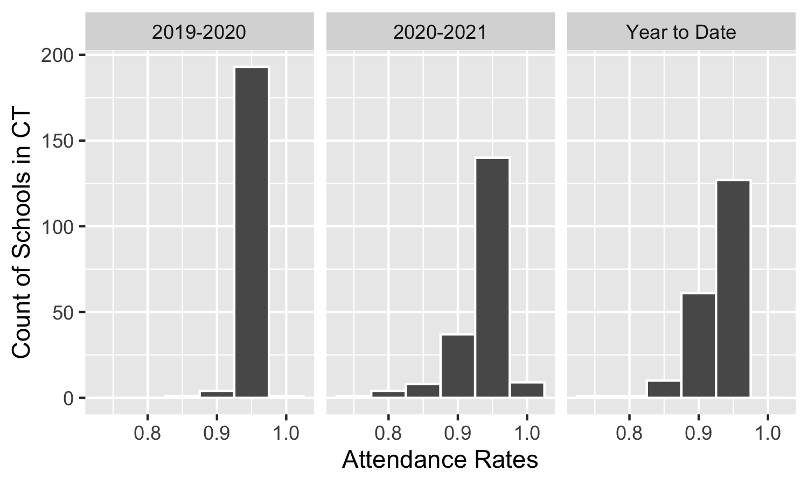

```{r setup, include=FALSE}
knitr::opts_chunk$set(dpi=300)
options(htmltools.dir.version = FALSE)
```

```{r xaringan-themer, include=FALSE}
# sds::duo_smith()
sds::mono_light_smith()
```


# Today's Learning Goals

* Be able to pivot longer, pivot wider, and recode values using R.

---

# How Would You Produce This Plot?

&lt;!-- --&gt;

---

# Observations vs. Variables vs. Values

.pull-left[

* Observations refer to individual units or cases of the data being collected.
* Variables describe something about an observation. 
* Values refer to the actual value associated with a variable for a given observation. 
]

.pull-right[


Grolemund, Garrett, and Hadley Wickham. n.d. R for Data Science. Accessed March 31, 2019. https://r4ds.had.co.nz/.

]

---

# What Is Tidy Data?

* Each variable must have its own column.
* Each observation must have its own row. 
* Each value must have its own cell. 

---

# Is This Tidy?

> What variables are displayed on this plot?

```{r echo=FALSE}
df <- data.frame(
  Date = c("03/19/2022", "03/18/2022"),
  Nrthmptn_AQI = c(70, 69),
  NYC_AQI = c(72, 60),
  Bstn_AQI = c(43, 59)
)

df
```


---

# What Will It Look Like When Tidy?

```{r}
df |> pivot_longer(cols = -Date, 
                    names_to = "City", 
                    values_to = "AQI") |>
  mutate(City = str_replace(City, "_AQI", ""))
```

---

# Pivoting Longer

* We use `pivot_longer()` to pivot a datasets from wider to longer format:
* `pivot_longer()` takes the following arguments: 
  1. `cols = `: Identify a series of columns to pivot.
    * The names of those columns will become repeated rows in the pivoted data frame, and the values in those columns will be stored in a new column.
  2. `names_to = `: Identify a name for the column where the column names will be store.
  3. `values_to = `: Identify a name for the column were the values associated with those names will be stored.
  4. Various arguments to support transformations to names.

---

# Example

```{r echo=FALSE}
df <- data.frame(
  Date = c("03/19/2022", "03/18/2022"),
  Nrthmptn_AQI = c(70, 69),
  NYC_AQI = c(72, 60),
  Bstn_AQI = c(43, 59)
)

df
```

.pull-left[
```{r eval=FALSE}
df |> pivot_longer(cols = -Date, 
                    names_to = "City", 
                    values_to = "AQI") |>
  mutate(City = str_replace(City, "_AQI", ""))
```
]

.pull-right[
```{r echo=FALSE}
df |> pivot_longer(cols = -Date, 
                    names_to = "City", 
                    values_to = "AQI") |>
  mutate(City = str_replace(City, "_AQI", ""))
```
]

---

# Recoding Values

* `case_when()` allows us to assign new values to a cell when a certain condition is met.
* Vectorized 'if/else' statement.
* Argument format: CONDITION ~ REPLACEMENT VALUE WHEN CONDITION MET

.pull-left[
```{r eval=FALSE}
df |> pivot_longer(cols = -Date, 
                    names_to = "City", 
                    values_to = "AQI") |>
  mutate(City = str_replace(City, "_AQI", "")) |>
  mutate(City = case_when(
    City == "Nrthmptn" ~ "Northampton",
    City == "NYC" ~ "New York City",
    City == "Bstn" ~ "Boston"
  )) |>
  select(Date, City)
```
]

.pull-right[
```{r echo=FALSE}
df |> pivot_longer(cols = -Date, 
                    names_to = "City", 
                    values_to = "AQI") |>
  mutate(City = str_replace(City, "_AQI", "")) |>
  mutate(City = case_when(
    City == "Nrthmptn" ~ "Northampton",
    City == "NYC" ~ "New York City",
    City == "Bstn" ~ "Boston"
  )) |>
  select(Date, City)
```

]

---

# Pivoting Wider

* We use `pivot_wider()` to pivot a datasets from longer to wider format:
* `pivot_wider()` takes the following arguments: 
  1. `names_from = `: Identify the column to get the new column names from.
  2. `values_from = `: Identify the column to get the cell values from.
  3. Various arguments to support transformations to names.

---

# Example

.pull-left[
```{r echo=FALSE}
df |> pivot_longer(cols = -Date, 
                    names_to = "City", 
                    values_to = "AQI") |>
  mutate(City = str_replace(City, "_AQI", "")) |>
  mutate(City = case_when(
    City == "Nrthmptn" ~ "Northampton",
    City == "NYC" ~ "New York City",
    City == "Bstn" ~ "Boston"
  )) |>
  select(Date, City)
```
]

.pull-right[
```{r eval=FALSE}
df |> pivot_wider(names_from = "Date", 
                   values_from = "AQI", 
                   names_repair = make.names)
```
]

```{r echo=FALSE}
df |> pivot_wider(names_from = "Date", 
                   values_from = "AQI", 
                   names_repair = make.names)
```

---

# Renaming Columns

> Use `rename(NEW_COLUMN_NAME = EXISTING_COLUMN_NAME)` 

```{r}
df |> pivot_wider(names_from = "Date", 
                   values_from = "AQI", 
                   names_repair = make.names) |>
  rename(Mar19 = X03.19.2022,
         Mar18 = X03.18.2022)
```

---

# CT School Attendance Example

```{r message=FALSE, warning=FALSE}
library(tidyverse)
ct_school_attendance &lt;- read_csv("data/ct_school_attendance.csv") |>
  filter(studentgroup == "All Students" &amp; 
           reportingdistrictname != "Connecticut")

head(ct_school_attendance)
```

--- 

```{r}
ct_school_attendance_tidy <- ct_school_attendance |>
  select(reportingdistrictname, starts_with("attrate_")) |>
  pivot_longer(cols = starts_with("attrate_"), 
               names_to = "school_year",
               values_to = "attendance_rates",
               names_prefix = "attrate_") 
      
head(ct_school_attendance_tidy)
```

---

```{r}
ct_school_attendance_tidy &lt;- 
  ct_school_attendance |>
  select(reportingdistrictname, starts_with("attrate_")) |>
  pivot_longer(cols = starts_with("attrate_"), 
               names_to = "school_year",
               values_to = "attendance_rates",
               names_prefix = "attrate_") |>
  mutate(school_year = case_when(
    school_year == "ytd" ~ "Year to Date", 
    school_year == "202021" ~ "2020-2021",
    school_year == "201920" ~ "2019-2020"))
```

---

```{r fig.height=2, fig.width=5, message=FALSE, warning=FALSE}
ct_school_attendance_tidy |>
  ggplot(aes(x = attendance_rates)) +
  geom_histogram(binwidth = 0.05, color = "white") +
  facet_wrap(vars(school_year)) +
  labs(x = "Attendance Rates", y = "Count of Schools in CT")
```

---

```{r message=FALSE, warning=FALSE}
ct_school_attendance <- read_csv("data/ct_school_attendance.csv") |>
  filter(reportingdistrictname != "Connecticut") |>
  select(reportingdistrictname, studentgroup, attrate_202021) 

head(ct_school_attendance)
```

---

```{r}
ct_school_attendance |>
  pivot_wider(names_from = studentgroup,
               values_from = attrate_202021,
               names_repair = make.names) |> head()
```


