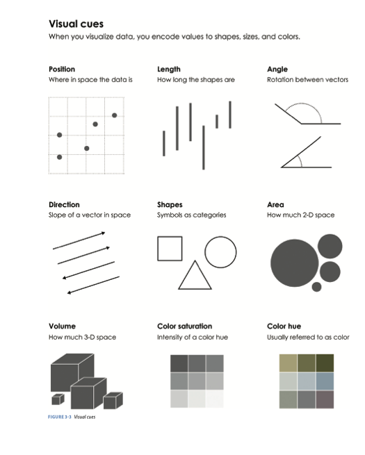
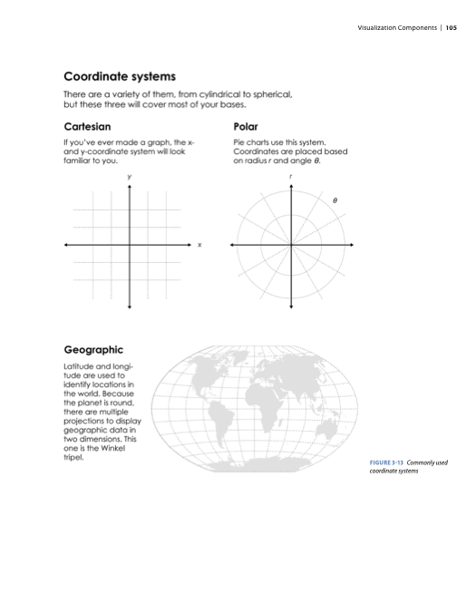
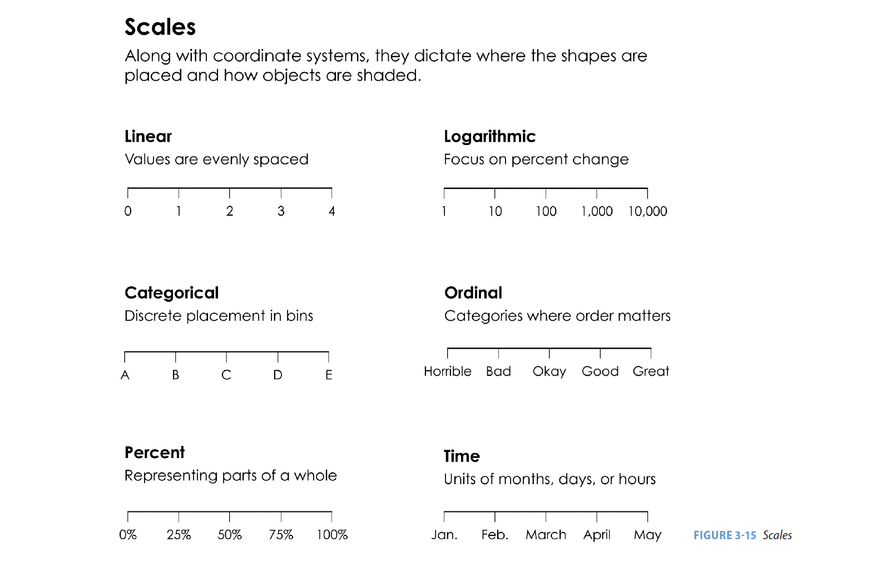
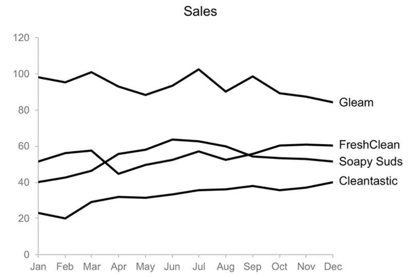
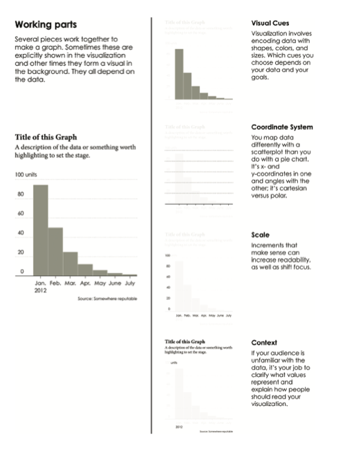
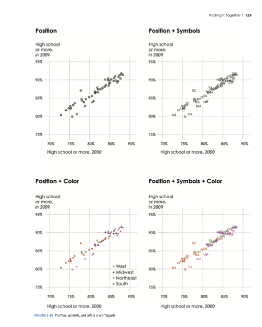

```{r setup, include=FALSE}
options(htmltools.dir.version = FALSE)
library(tidyverse)
```

```{r xaringan-themer, include=FALSE}
# sds::duo_smith()
sds::mono_light_smith()
```

# For Today

* grammar of graphics
* cartesian plots in ggplot
* visualization context

---

# Elements of Data Graphics

* Visual cues
      * Position, length, area, etc. 
* Coordinate system
      * How are the data points organized?
* Scale
      * How does distance translate into meaning?
* Context
      * In relation to what?
* Small multiples and layers
      * How is multivariate information incorporated into a two-dimensional data graphic?

(Framework drawn from: Yau, Nathan. 2013. *Data Points: Visualization That Means Something*. 1st edition. Indianapolis, IN: Wiley.)

---



---



---


      
---

# Context

* Titles
  * A descriptive title is used to introduce the graph. 
* Labels
  * Axes and points are labeled to indicate what data is represented on the graph. 
* Legends
  * The meaning of varying colors, sizes, and shapes are represented in a legend. 
* Captions
  * Further detail about the plot is provided in explanatory text. 

---
      

      
---
      

      
---
      

      
---

class: center, middle
# Today, and in the upcoming weeks, we are going to focus on creating Cartesian plots in `R`. 

---

# What visual cues, scales, and context are represented on this plot?

```{r echo=FALSE, fig.height=5, fig.retina=2, fig.width=10}
pioneer_valley_census_data <- read.csv("https://raw.githubusercontent.com/SDS-192-Intro/SDS-192-public-website/main/slides/datasets/pioneer_valley_census.csv")
hampshire_census_data <- pioneer_valley_census_data %>% 
  filter(COUNTY == "Hampshire")

ggplot(hampshire_census_data, 
       aes(x = COMMUNITY, 
           y = CEN_MEDHHINC)) +
  geom_col() +
  theme_minimal() +
  coord_flip() +
  labs(title = "Median Household Income of Municipalities in Hampshire County, MA 2018",
       x = "Municipality",
       y = "Median Household Income")
```

---

# What visual cues, scales, and context are represented on this plot?

```{r echo=FALSE, fig.height=5, fig.retina=2, fig.width=10}
pioneer_valley_census_data$CEN_PAINC_RATE <- 
  pioneer_valley_census_data$CEN_PAINC / pioneer_valley_census_data$CEN_HOUSEHOLDS
pioneer_valley_census_data$CEN_SINGPARHOU_RATE <- 
  pioneer_valley_census_data$CEN_SINGPARHOU / pioneer_valley_census_data$CEN_HOUSEHOLDS

ggplot(data = pioneer_valley_census_data, 
       aes(x = CEN_PAINC_RATE, 
           y = CEN_SINGPARHOU_RATE, 
           col = COUNTY,
           size = CEN_HOUSEHOLDS)) +
  geom_point() + 
  theme_minimal() +
  labs(title = "Household Characteristics of Pioneer Valley Municipalities, 2018",
       x = "Proportion of Households on Public Assistance Income",
       y = "Proportion of Single Parent Households ",
       col = "County",
       size = "Number of Households") 
```

---


# Let's create the following data frame to motivate today's lecture. 

> This dataset comes from [Pioneer Valley Data](https://pioneervalleydata.org/data-download-page/) and documents estimates of population characteristics for each municipality in the Pioneer Valley. 

```{r}
library(tidyverse)
pioneer_valley_census_data <- read.csv("https://raw.githubusercontent.com/SDS-192-Intro/SDS-192-public-website/main/slides/datasets/pioneer_valley_census.csv")
hampshire_census_data <- pioneer_valley_census_data %>% 
  filter(COUNTY == "Hampshire")
```

---

# Data Ethics Questions

1. What assumptions and commitments informed the design of this dataset?
  * Definitions for certain census categories like "Unemployed" or "Poverty" may exclude certain people.
  * Shifting categorizations for race, gender, and other demographics may not represent how people identify.
2. Who has had a say in data collection and analysis regarding this dataset? Who has been excluded?
  * US Census Bureau and other governing bodies
  * Activists and social movements
3. What are the benefits and harms of this dataset, and how are they distributed amongst diverse social groups? 
  * Concerns about surveillance or mistreatment amongst those counted.
  * Concerns about under-representation amongst those uncounted. 

---

# ggplot

* Most of the plots we create in this course will rely on a package called `ggplot`
* `ggplot` is included in the Tidyverse, which you installed on Monday. We can load `ggplot` by calling `library(ggplot2)`
* Load `ggplot` in your environment. 

```{r}
library(ggplot2)
```

---

# Basic Formula `ggplot()` functions

* To create plots, we can call the `ggplot()` function. 
* The first argument in the `ggplot()` function is the dataset we'd like to reference to create a plot.
* The second argument is called `mapping` and indicates the variables/columns from the dataset we'd like to plot. We wrap a list of these variables in `aes()`
  * In a Cartesian plot, we must supply the variables/columns that will appear on the axes (via `x = ` and `y = `)
  
---
  
```{r, fig.height=5, fig.retina=2, fig.width=10}
ggplot(data = hampshire_census_data, 
       aes(x = COMMUNITY, 
           y = CEN_EARLYED))
```

---

class: center, middle
# When we supply a nominal variable in our dataset to the x-axis mapping, what will the scale be? 

---

class: center, middle
# When we supply a continuous variable in our dataset to the x-axis mapping, what will the scale be? 

> If you were confused regarding these questions, you should study up on Data Fundamentals before starting Quiz 1!
---

# Where's the data?

* In the previous plot, we told `R` *what* variables to plot, but we didn't indicate *how* to plot them.
  * What visual marks should appear on the graph?
* To do this, we need to add a *geom function* to our `ggplot` call, indicating the type of plot we'd like to create. Examples:
  * Bar plots: `geom_bar()`
  * Scatterplots: `geom_point()`
* We append this function, along with additional functions for styling the plot, using a `+` sign.

---

```{r, fig.height=5, fig.retina=2, fig.width=10}
ggplot(data = hampshire_census_data, 
       aes(x = COMMUNITY, 
           y = CEN_EARLYED)) +
  geom_col() +
  coord_flip() # Flipping the x and y coordinates here makes the labels more legible.
```

---

# Adding Context to Plots

* What context should *always* be included on a plot?
  * Unit of Observation
  * Variables Represented
  * Filters
  * Geographic Scope
  * Temporal Scope
* We can add this context via titles and labels, using the `labs()` function. 
  
> Hint: This **will** make an appearance on your next quiz!

---
  
```{r, fig.height=5, fig.retina=2, fig.width=10}
ggplot(data = hampshire_census_data, 
       aes(x = COMMUNITY, 
           y = CEN_EARLYED)) +
  geom_col() +
  coord_flip()  + # Flipping the x and y coordinates here makes the labels more legible.
  labs(title = "Hampshire County Early Education Enrollment Rates, 2018", 
       x = "Enrollment Rate for 3-4 yr old", 
       y = "Municipality in Hampshire County, MA")
```

---

```{r, fig.height=5, fig.retina=2, fig.width=10}
# Adjust the Scale
ggplot(data = pioneer_valley_census_data, 
       aes(x = COUNTY,y = CEN_WORKERS)) +
  geom_point() +
  coord_flip() +
  scale_y_log10() +
  labs(title = "Number of Workers Age 16+ in Pioneer Valley, MA Municipalities, 2018", x = "County", y = "Workers Age 16+")
```

---

# For Friday

* Reading on Visualization Conventions
* Quiz 1 posted

