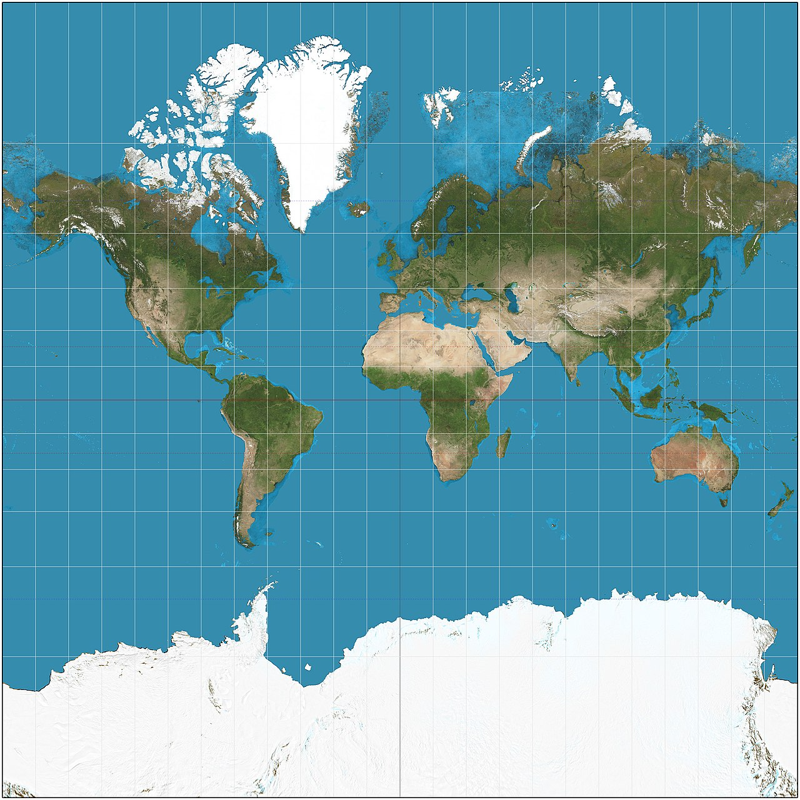
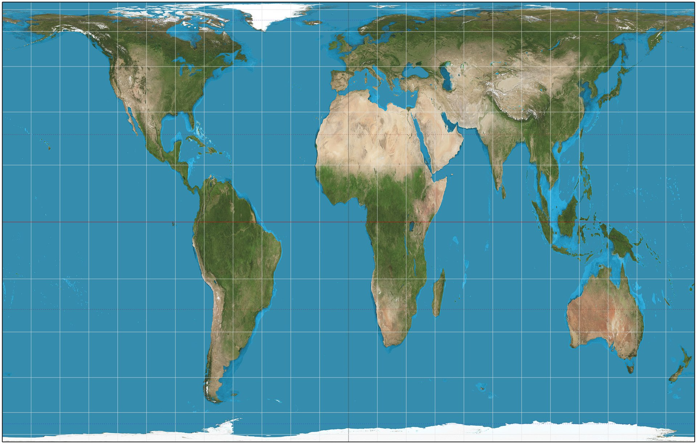
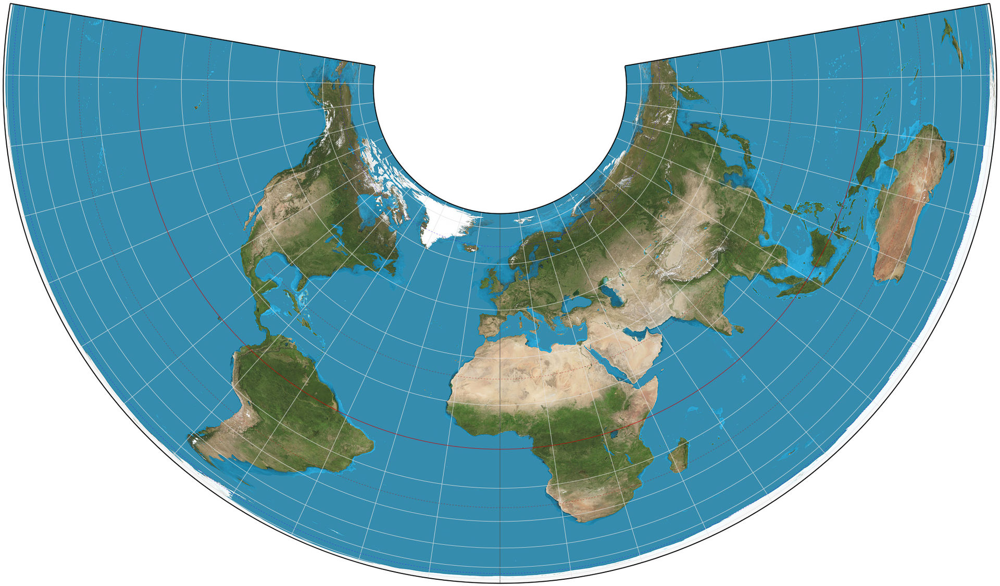
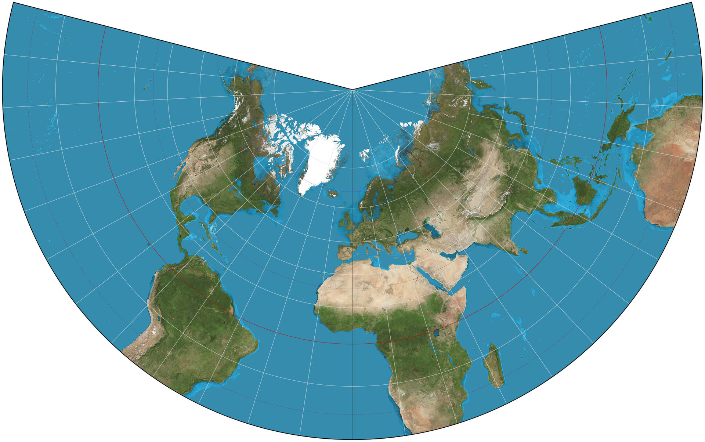
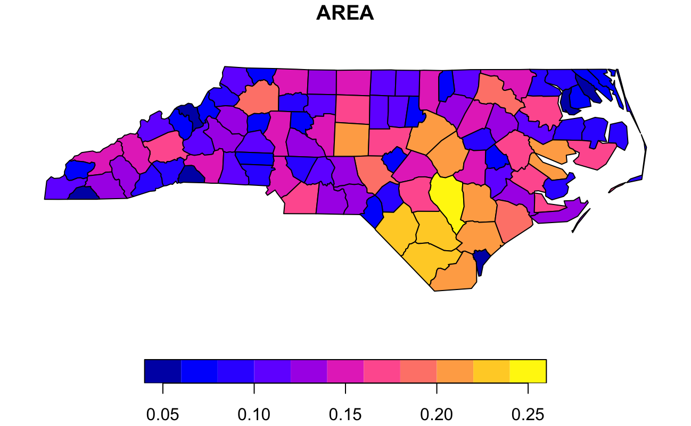
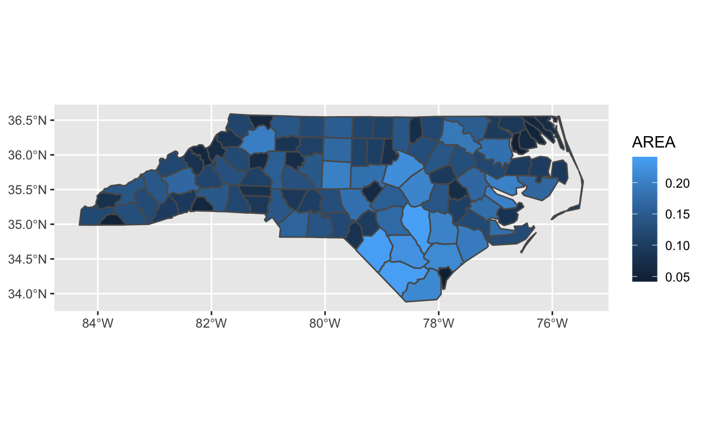

# Today's Learning Goals

* Understand projections.
* Use `sf` package for static maps in `ggplot2` and loading shapefiles.

---

# Why Analyze Spatial Data?

* How are features distributed across geographies, and what does this tell us about potential disparities?
* Where are certain events or features concentrated, and what other conditions might implicate these patterns?
* What kinds of features are proximate, and what impact might this have?
* What is the best way to get from point A to point B?

---

# Projections

<iframe width="560" height="315" src="https://www.youtube.com/embed/vVX-PrBRtTY" title="YouTube video player" frameborder="0" allow="accelerometer; autoplay; clipboard-write; encrypted-media; gyroscope; picture-in-picture" allowfullscreen></iframe>

---

# Projections

* Means by which we convert curved surface of the globe to a 2D representation.
* Necessarily distorts the surface.
* Properties:
      * Area
      * Shape
      * Direction
      * Bearing
      * Distance
* Every projection represents a trade-off in accuracy among these properties.

---

# Orange Peel Example

.pull-left[
* Imagine that you peel an orange
  * Datum is the original shape of the fruit (e.g. orange, lemon, apple, grapefruit).
  * Projection is how we go about peeling and flattening the orange.
]
  
.pull-right[


https://geohackweek.github.io/visualization/02-projections/

]

---

# <a href="https://en.wikipedia.org/wiki/Mercator_projection">Mercator</a> (preserves angles)
      
 By &lt;a href=&quot;//commons.wikimedia.org/wiki/User:Strebe&quot; title=&quot;User:Strebe&quot;&gt;Strebe&lt;/a&gt; - &lt;span class=&quot;int-own-work&quot; lang=&quot;en&quot;&gt;Own work&lt;/span&gt;, <a href="https://creativecommons.org/licenses/by-sa/3.0" title="Creative Commons Attribution-Share Alike 3.0">CC BY-SA 3.0</a>, <a href="https://commons.wikimedia.org/w/index.php?curid=17700069">Link</a>    

---
      
# <a href="https://en.wikipedia.org/wiki/Gall%E2%80%93Peters_projection">Gall-Peters</a> (preserves area)
      
 By &lt;a href=&quot;//commons.wikimedia.org/wiki/User:Strebe&quot; title=&quot;User:Strebe&quot;&gt;Strebe&lt;/a&gt; - &lt;span class=&quot;int-own-work&quot; lang=&quot;en&quot;&gt;Own work&lt;/span&gt;, <a href="https://creativecommons.org/licenses/by-sa/3.0" title="Creative Commons Attribution-Share Alike 3.0">CC BY-SA 3.0</a>, <a href="https://commons.wikimedia.org/w/index.php?curid=16115242">Link</a>

---

# <a href="https://en.wikipedia.org/wiki/Albers_projection">Albers Equal Area</a>
      
 By &lt;a href=&quot;//commons.wikimedia.org/wiki/User:Strebe&quot; title=&quot;User:Strebe&quot;&gt;Strebe&lt;/a&gt; - &lt;span class=&quot;int-own-work&quot; lang=&quot;en&quot;&gt;Own work&lt;/span&gt;, <a href="https://creativecommons.org/licenses/by-sa/3.0" title="Creative Commons Attribution-Share Alike 3.0">CC BY-SA 3.0</a>, <a href="https://commons.wikimedia.org/w/index.php?curid=16115144">Link</a>      
 
---
      
# <a href="https://en.wikipedia.org/wiki/Lambert_conformal_conic_projection">Lambert Conformal Conic</a>      
      
 By &lt;a href=&quot;//commons.wikimedia.org/wiki/User:Strebe&quot; title=&quot;User:Strebe&quot;&gt;Strebe&lt;/a&gt; - &lt;span class=&quot;int-own-work&quot; lang=&quot;en&quot;&gt;Own work&lt;/span&gt;, <a href="https://creativecommons.org/licenses/by-sa/3.0" title="Creative Commons Attribution-Share Alike 3.0">CC BY-SA 3.0</a>, <a href="https://commons.wikimedia.org/w/index.php?curid=16115295">Link</a>
      
---      

# Coordinate Reference System (CRS)

* Points are in different locations depending on how we flatten Earth's surface into 2D map. 
* CRS is a system for locating features on a certain map projection via coordinates. 
* Thousands of CRSs but some are more common than others (e.g. WGS 84 most common).
* For locations to appear correctly on maps, geographic features and underlying maps need to share same CRS.

---

# Spatial Packages in R

* Working with shapefiles
      * `sf` package for everything
* Plotting
      * `ggplot2` for static maps
      * `leaflet` for interactive maps
      
---

# Shapefiles

* File for storing geospatial feature data.
* Actually a series of files (.shp, .shx, and .dbf) that must **all** be present in the directory for the shapefile to import. 
* Imported file ends in `.shp` and contains feature geometry.

---

# `sf` Package

```r
library(sf)
nc &lt;- system.file("shape/nc.shp", package = "sf") |>
  st_read()
```
      
```
## Reading layer `nc' from data source `/Library/Frameworks/R.framework/Versions/4.1-arm64/Resources/library/sf/shape/nc.shp' using driver `ESRI Shapefile'
## Simple feature collection with 100 features and 14 fields
## Geometry type: MULTIPOLYGON
## Dimension:     XY
## Bounding box:  xmin: -84.32385 ymin: 33.88199 xmax: -75.45698 ymax: 36.58965
## Geodetic CRS:  NAD27
```
     
```r
class(nc)
```

```
## [1] "sf"         "data.frame"
```
      
---

```r
library(tidyverse)
nc|>
  select(AREA, NAME, geometry)
```

```
## Simple feature collection with 100 features and 2 fields
## Geometry type: MULTIPOLYGON
## Dimension:     XY
## Bounding box:  xmin: -84.32385 ymin: 33.88199 xmax: -75.45698 ymax: 36.58965
## Geodetic CRS:  NAD27
## First 10 features:
##     AREA        NAME                       geometry
## 1  0.114        Ashe MULTIPOLYGON (((-81.47276 3...
## 2  0.061   Alleghany MULTIPOLYGON (((-81.23989 3...
## 3  0.143       Surry MULTIPOLYGON (((-80.45634 3...
## 4  0.070   Currituck MULTIPOLYGON (((-76.00897 3...
## 5  0.153 Northampton MULTIPOLYGON (((-77.21767 3...
## 6  0.097    Hertford MULTIPOLYGON (((-76.74506 3...
## 7  0.062      Camden MULTIPOLYGON (((-76.00897 3...
## 8  0.091       Gates MULTIPOLYGON (((-76.56251 3...
## 9  0.118      Warren MULTIPOLYGON (((-78.30876 3...
## 10 0.124      Stokes MULTIPOLYGON (((-80.02567 3...
```

---

```r
nc|>
  st_geometry()|>
  pluck(1)
```

```
## MULTIPOLYGON (((-81.47276 36.23436, -81.54084 36.27251, -81.56198 36.27359, -81.63306 36.34069, -81.74107 36.39178, -81.69828 36.47178, -81.7028 36.51934, -81.67 36.58965, -81.3453 36.57286, -81.34754 36.53791, -81.32478 36.51368, -81.31332 36.4807, -81.26624 36.43721, -81.26284 36.40504, -81.24069 36.37942, -81.23989 36.36536, -81.26424 36.35241, -81.32899 36.3635, -81.36137 36.35316, -81.36569 36.33905, -81.35413 36.29972, -81.36745 36.2787, -81.40639 36.28505, -81.41233 36.26729, -81.43104 36.26072, -81.45289 36.23959, -81.47276 36.23436)))
```
 
---

```r
nc|>
  select("AREA",geometry)|>
  plot()
```


      
---
      
# `ggplot2` Support

* Use `geom_sf()`.
* Mapping (x, y) to geometry is implied!
      
```r
ggplot(nc,aes(fill=AREA))+
  geom_sf()
```


