# Today's Learning Goals

* Map geographic boundaries in `leaflet`.
* Create choropleth maps.
* Recognize misleading maps.

---

# Mapping Polygons

* Not all cartographic data is encoded as a latitude and longitude!
* Some cartographic data is encoded as regularly or irregularly shaped polygons.
* Can demarcate:
  * Administrative boundaries (e.g. census tracts, zip codes, states). 
  * Feature boundaries (e.g. buildings, bodies of water).
  * Buffers (e.g. areas at a specified distance from a point source).

---

# Administrative Boundaries: US Census

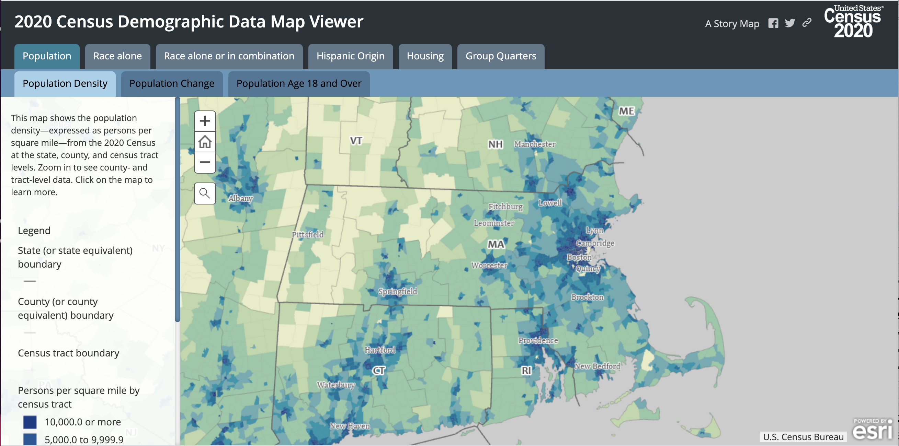


---

# Administrative Boundaries: US Census

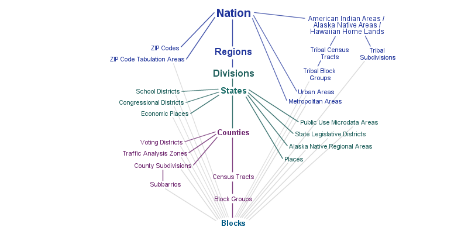

---

# Administrative Boundaries: US Census

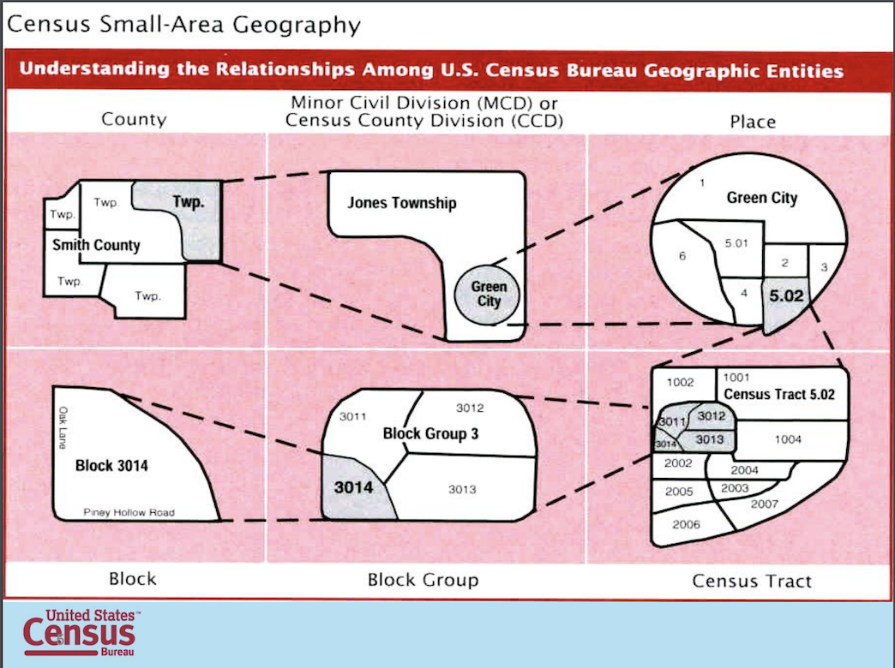


---

# Administrative Boundaries: [NYC Boundaries Map](https://boundaries.beta.nyc/)

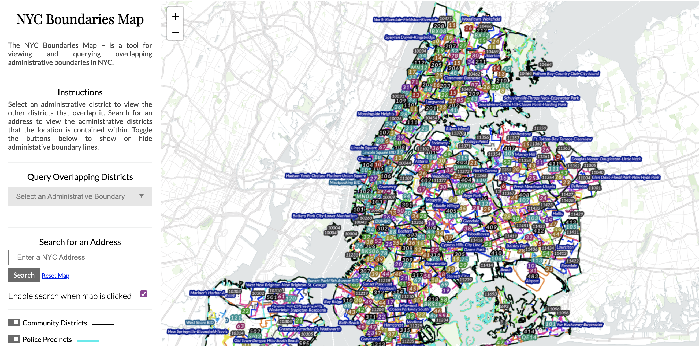

---

# Feature Boundaries

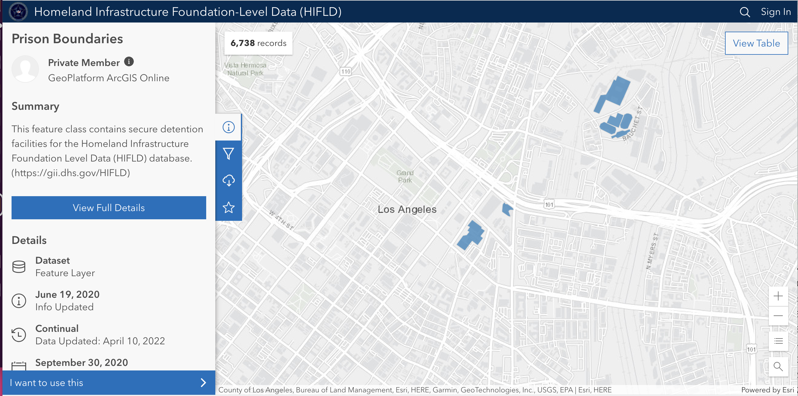
---

# Feature Boundaries

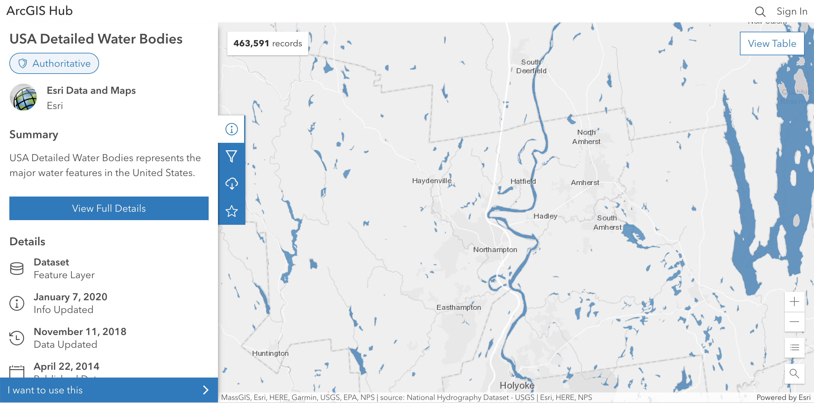

---

# Mapping Polygons in `leaflet`


```r
library(sf)
nc <- system.file("shape/nc.shp", package = "sf") |>
  st_read()

leaflet() |>
  addTiles()|>
  addPolygons(data=st_transform(nc,4326))
```

---
      
# Choropleth Maps

* Use different shading and colors based on numerical data.
* How you set the bins corresponding to the color gradient can affect how your map looks. Let's introduce two approaches:
      * Equally sized interval bins. 
      * Quantile based bins.
      
---

# Equal Intervals
      
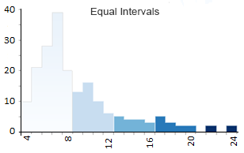
      
---      

# Quantile
      
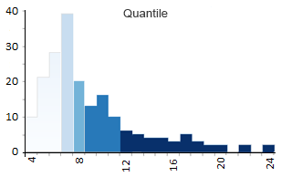
      
---
      
# All Classes Map
      
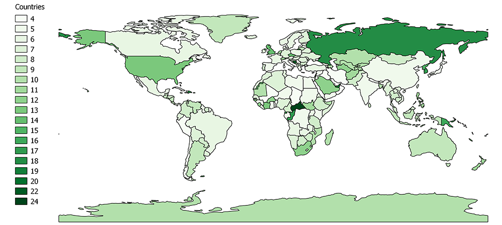
      
---
      
# Equal Intervals Choropleth Map
      
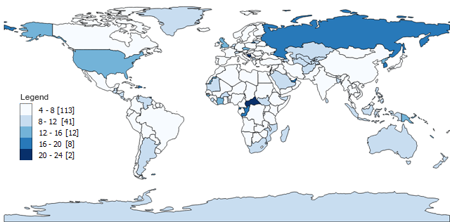
      
---
      
# Quantile Choropleth Map
      
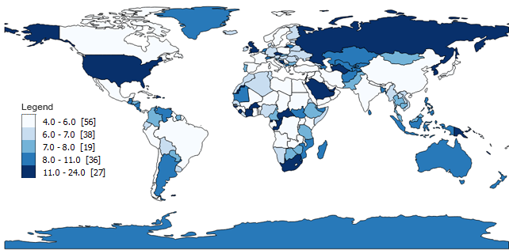
      
---
      
# Acknowledgements

This part of today's lecture "How to Lie with Maps" is almost entirely structured based on:

&gt; Deluca, Eric, and Sara Nelson. 2017. "7. Lying With Maps." In Mapping, Society, and Technology, edited by Steven Manson. Minneapolis, Minnesota: University of Minnesota Libraries Publishing.
 [https://open.lib.umn.edu/mapping/chapter/7-lying-with-maps/](https://open.lib.umn.edu/mapping/chapter/7-lying-with-maps/).
      
---
      
# Symbolization


.pull-left[


]

.pull-right[


]
      
---
      
# Cartograms

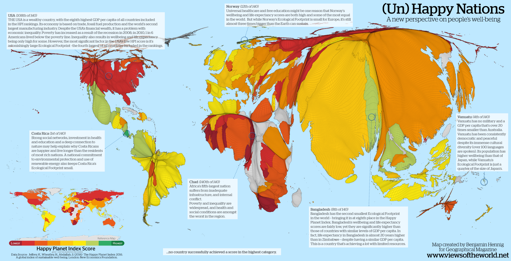

&gt; Benjamin Hennig, [https://www.viewsoftheworld.net/](https://www.viewsoftheworld.net/)
      
---
      
# Aggregation
      
* Ecological fallacy: Assuming that a value calculated for a group is equivalent to the values for individual members of the group.
      
---
      
# Zonation

.pull-left[
* Modifiable Aerial Unit Problem.
* The boundaries we aggregate data into are often arbitrary (i.e. not meaningful for the analysis).
  * If I'm studying air quality effects of a facility on surrounding populations, air pollution doesn't stop at a zip code even if I aggregate my data by zip code.
* Drawing boundaries in a different way would produce different results.

]

.pull-right[


]
      
---
      
# Gerrymandering

&lt;iframe width="560" height="315" src="https://www.youtube.com/embed/bGLRJ12uqmk" title="YouTube video player" frameborder="0" allow="accelerometer; autoplay; clipboard-write; encrypted-media; gyroscope; picture-in-picture" allowfullscreen&gt;&lt;/iframe&gt;
      
---
      
# Prison-based Gerrymandering
      
&lt;iframe width="560" height="315" src="https://www.youtube.com/embed/xhxWkal1J58" title="YouTube video player" frameborder="0" allow="accelerometer; autoplay; clipboard-write; encrypted-media; gyroscope; picture-in-picture" allowfullscreen&gt;&lt;/iframe&gt;
