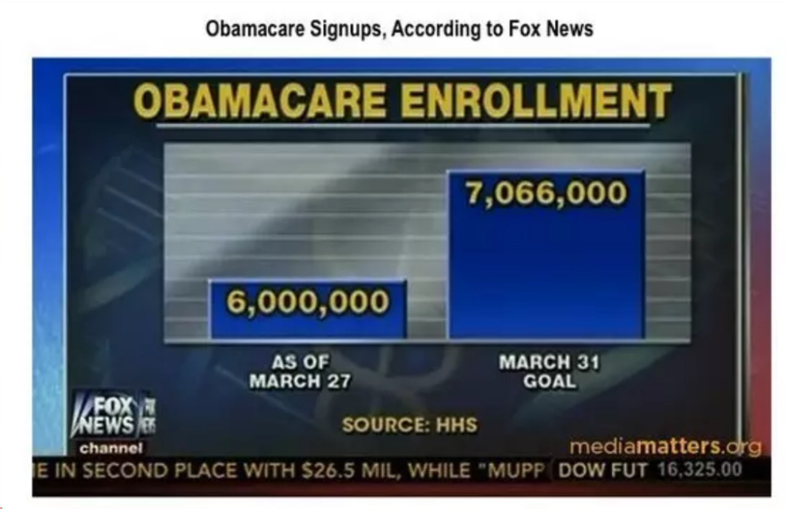

```{r setup, include=FALSE}
options(htmltools.dir.version = FALSE)
library(tidyverse)
```

```{r xaringan-themer, include=FALSE}
# sds::duo_smith()
sds::mono_light_smith()
```


# Today's Learning Goals

* Understand Tufte's principles of graphical integrity.
* Create linegraphs using ggplot2.

---

# "Graphical integrity refers to how accurately visual elements represent data. Information can vary widely, even for related data, so there's a desire and tendency to scale the data disproportionately in order to make it fit in the space allowed."

&gt; Framework drawn from: Tufte, Edward R. 2001. *The Visual Display of Quantitative Information*. 2nd edition. Graphics Press.

---

# 6 Principles of Graphical Integrity

* Representations of numbers should match their true proportions.
* Labeling should be clear and detailed.
* Designs should not vary from some ulterior motive, but show only data variations.
* In time-series displays of money, deflated and standardized units of monetary measurement are nearly always better than nominal units.
* The number of information-carrying (variable) dimensions depicted should not exceed the number of dimensions in the data.
* Graphics must not quote data out of context.

---

# Principles 1-3

.pull-left[

* Republicans from the U.S. Congress questioned Cecile Richards, the president of Planned Parenthood, regarding the misappropriation of $500 million in annual federal funding. This graph/chart was presented as a point of emphasis.
* Representative Jason Chaffetz of Utah explained: “In pink, that’s the reduction in the breast exams, and the red is the increase in the abortions. That’s what’s going on in your organization.”

]
      
.pull-right[


]

---
      
.pull-left[


      
]
      
.pull-right[


]

---



---

* <a href="https://qz.com/122921/the-chart-tim-cook-doesnt-want-you-to-see/">A misleading chart from Apple </a>
      


---

* Say the following piecharts represent results of an election poll at time points: A = September, B = October, and C = November. At each time point we present the proportion of the poll respondents who say they will support one of 5 candidates: 1 through 5.
* Based on these 3 piecharts, answer the following questions:
  * At time point A, is candidate 5 doing better than candidate 4?
  * Did candidate 3 do better at time point B or time point C?
  * Who gained more support between time point A and time point B, candidate 2 or candidate 4?
      


---


---

* <a href="https://infovis-wiki.net/wiki/Lie_Factor">The lie factor </a>
  * Often not very clearly defined.
  * Easy to lie by manipulating scales.
  * Why perspective?
  * Width of lines?
      


---

# Principle 5

* The number of information-carrying (variable) dimensions depicted should not exceed the number of dimensions in the data.

.pull-left[
      
&lt;img src="img./Lec3_3D_confusing_in_bar_graph.svg.png" width="250" /&gt; 
By &lt;a href=&quot;//commons.wikimedia.org/wiki/User:Smallman12q&quot; title=&quot;User:Smallman12q&quot;&gt;Smallman12q&lt;/a&gt; - &lt;span class=&quot;int-own-work&quot; lang=&quot;en&quot;&gt;Own work&lt;/span&gt;, <a href="http://creativecommons.org/publicdomain/zero/1.0/deed.en" title="Creative Commons Zero, Public Domain Dedication">CC0</a>, <a href="https://commons.wikimedia.org/w/index.php?curid=20349111">Link</a>

]
      
.pull-right[
      
&lt;img src="img./Lec3_3D_bar_graph.svg.png" width="250" /&gt; 
By &lt;a href=&quot;//commons.wikimedia.org/wiki/User:Smallman12q&quot; title=&quot;User:Smallman12q&quot;&gt;Smallman12q&lt;/a&gt; - &lt;span class=&quot;int-own-work&quot; lang=&quot;en&quot;&gt;Own work&lt;/span&gt;, <a href="http://creativecommons.org/publicdomain/zero/1.0/deed.en" title="Creative Commons Zero, Public Domain Dedication">CC0</a>, <a href="https://commons.wikimedia.org/w/index.php?curid=20377685">Link</a>

]
      
---
      
# Principle 6
      
&lt;img src="img./Lec3_GraphicalIntegrity_4.png" width="600" /&gt;
      
---


      
---


      
---
      
# Recap Principles of Graphical Integrity

* Show ***data variation***, not design variation.
* Clear, detailed, and thorough ***labeling*** and ***appropriate scales***.
* Size of the ***graphic effect*** should be ***directly proportional to the numerical quantities***.
* Be mindful of ***context*** when designing data graphics.
* ***Don't*** use pie charts and 3D charts.
