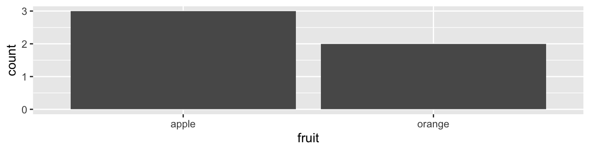
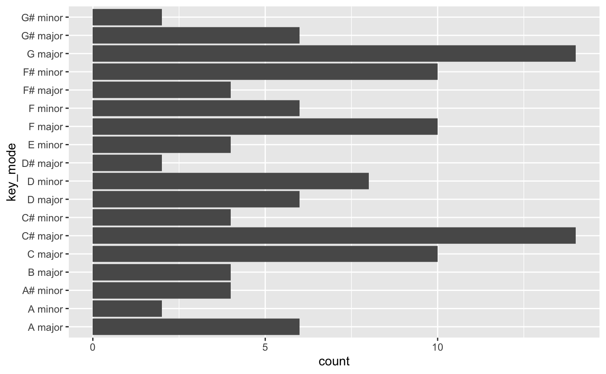

```{r setup, include=FALSE}
knitr::opts_chunk$set(dpi=300)
options(htmltools.dir.version = FALSE)
library(tidyverse)
```

```{r xaringan-themer, include=FALSE}
# sds::duo_smith()
sds::mono_light_smith()
```


# Today's Learning Goals

* Create histograms using ggplot2.
* Create barplots using ggplot2.

---

class: center, middle
# The most important take-away from today is that frequency plots (histograms and barplots) involve *counting* the values in a variable. 

---

# Levels of Measurement

.pull-left[
* A ***categorical*** variable (a.k.a. qualitative variable) is a variable that can take on one of a limited, and usually fixed, number of possible values.
  * Nominal variable
  * Ordinal variable
]
      
.pull-right[

]

---
 
# Levels of Measurement
      
.pull-left[
* A ***numerical*** variable (a.k.a. quantitative variable, continuous variable) is a variable that can take on any value on the measurement scale that we are using.
  * Interval variable
  * Ratio variable
]
      
.pull-right[

]

---

# Histogram

.pull-left[
* Visualizes *distribution* of a ***numerical*** variable
  * What are maximum and minimum values?
  * How spread out are the values?
  * What is the "center" or "most typical" value?
  * What are frequent and infrequent values?
]
.pull-right[
&lt;!-- --&gt;&lt;!-- --&gt;
]

---

# Histogram

.pull-left[
1. Create bins for numbers, each with the same range of values [i.e. 10-20, 20-30, 30-40, and so on].
2. Count the numbers in each bin.
3. Set the height of a bar for that bin to the count. 
]
.pull-right[
&lt;!-- --&gt;
]

---

# Barplots

.pull-left[
* Visualizes *counts* of a ***categorical*** variable
  * Which value appears the most?
  * Which value appears the least?
  * How evenly distributed are the counts?
]
.pull-right[
&lt;!-- --&gt;
]

---

# Barplots

.pull-left[
1. Determine the unique values and places them on the x-axis.
2. Count the number of times each value appears.
3. Set the height of a bar for that category to the count. 
]
.pull-right[
&lt;!-- --&gt;
]

---

# Barplots

.pull-left[
* Is *not* pre-counted in your data frame, we use `geom_bar()`.
* Is pre-counted in your data frame, we use `geom_col()` with the y-position aesthetic mapped to the variable that has the counts.
]
.pull-right[
&lt;!-- --&gt;&lt;!-- --&gt;
]

---

# Today's Dataset

* Spotify has an Application Programming Interface (API) that allows us to access data about music on the platform.
* We can access data about specific songs, playlists, and artists.
* Today we are going to access data about the tracks for a few different artists.
* Variables include things such as acousticness, danceability, and speechiness, album information, and key.

---

# Step 1: Install and Load Packages

* In your console install the Spotify R package:

`install.packages("spotifyr")`

* Then load the packages for this in-class exercise by running the code below. 

```{r}
#Load packates
library(tidyverse)
library(spotifyr)
```

---

# Step 2: Create an Spotify Developer Account

1. Log-in to Spotify.com or create an account.
2. Go to <a href="https://developer.spotify.com/dashboard">https://developer.spotify.com/dashboard </a>
3. Create an app named "SDS 192 Lec 04 In-class Exercise". You can indicate that this is "for frequency plots".
4. Click "SHOW CLIENT SECRET".
5. Copy client id and secret below, and then run the code chunk.

```{r}
id <- 'COPY_ID_HERE'
secret <- 'COPY_SECRET_HERE'
Sys.setenv(SPOTIFY_CLIENT_ID = id)
Sys.setenv(SPOTIFY_CLIENT_SECRET = secret)
access_token <- get_spotify_access_token()
```

---

# Step 3: Get Song Features for Your Favorite Artist

* Replace the text FILL FAVORITE ARTIST NAME HERE below with the name of your favorite artist and then run the code chunk. 

```{r}
artist <- get_artist_audio_features(artist = "FILL FAVORITE ARTIST NAME HERE") |>
  select(-c(album_images, artists, available_markets))
```

---

# Step 4: Create a Histogram Visualizing the Distribution of Values in a Song Feature of Your Choice

.pull-left[

```r
ggplot(artist, aes(x = danceability)) +
  geom_histogram()
```

&gt; What does this message mean?

]
.pull-right[

&lt;!-- --&gt;
]

---

# Adjusting the Bins

.pull-left[
* Binwidth indicates the width of the buckets we'd like to categorize our data into.
* Bins indicates the number of bins to create. 
* We choose one or the other when creating histograms. 
]
.pull-right[

```r
ggplot(artist, aes(x = danceability)) +
  geom_histogram(binwidth = 0.1, color = "white")
```

&lt;!-- --&gt;
]

---

# Faceting a Histogram

.pull-left[
```r
ggplot(artist, aes(x = danceability)) +
  geom_histogram(binwidth = 0.1, color = "white") +
  labs(title = "Distribution of Danceability of Songs by Janelle Monáe, Spotify, 2022", 
       x = "Danceability", 
       y = "Count of Songs") +
  facet_wrap(vars(album_name))
```

&gt; What do we learn from this plot?

]
.pull-right[
&lt;!-- --&gt;
]

---

# Step 5: Create a Stacked, Dodged, or Filled Barplot Visualizing the Frequency of Songs in Each Album and Key Mode for This Artist

.pull-left[

```r
ggplot(artist, aes(x = key_mode)) +
  geom_bar() +
  coord_flip()
```
]
.pull-right[
&lt;!-- --&gt;
]

---

# Stacked Barplots

&gt; Note `fill = ` gets used for polygons, and `col = ` gets used for points and lines. 

.pull-left[

```r
ggplot(artist, aes(x = key_mode, fill = album_name)) +
  geom_bar() +
  coord_flip() +
  labs(title = "Frequency of Key Modes in Songs by Janelle Monae", 
       x = "Key Mode", 
       y = "Count of Songs", 
       fill = "Album Name") +
  scale_fill_brewer(palette = "Dark2")
```
&gt; How might I compare this across Janelle Monáe's albums?
]
.pull-right[
&lt;!-- --&gt;
]

---

# Dodging 

&gt; Setting the position to "dodge".
      
.pull-left[

```r
ggplot(artist, aes(x = key_name, fill = album_name)) +
  geom_bar(position = "dodge") +
  coord_flip() +
  labs(title = "Frequency of Key Modes in Songs by Janelle Monáe", 
       x = "Key Mode", 
       y = "Count of Songs", 
       fill = "Album Name") +
  scale_fill_brewer(palette = "Dark2")
```
]
.pull-right[
&lt;!-- --&gt;
]

---

# Converting to a Percentage Scale

&gt; Setting the position to "fill" converts the scale of the y-axis to a percentage.

.pull-left[

```r
ggplot(artist, aes(x = key_name, fill = album_name)) +
  geom_bar(position = "fill") +
  coord_flip() +
  labs(title = "Key Modes in Songs by Janelle Monáe", 
       x = "Key Mode", 
       y = "Percentage of Songs", 
       fill = "Album Name") +
  scale_fill_brewer(palette = "Dark2")
```
]
.pull-right[
&lt;!-- --&gt;
]
